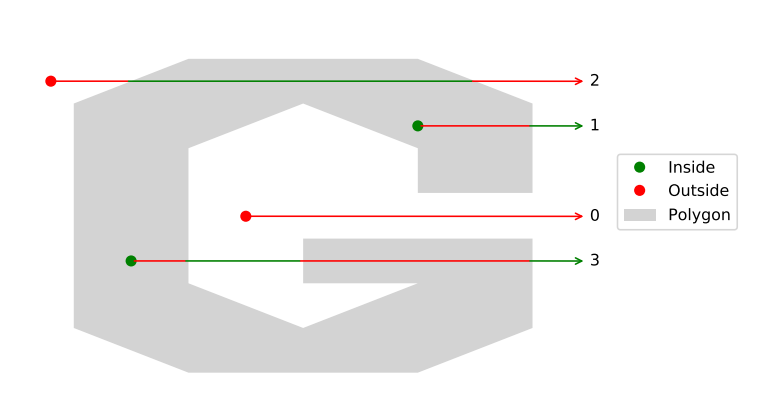

# Point in Polygon Test Algorithm

## Introduction

This algorithm can determine whether a point lies inside or outside a polygon, which is a fundamental operation of geospatial data science.

The point-in-polygon (PiP) problem is illustrated in the figure below, the grey area represents a polygon. The red points lie outside the polygon, the green points lie inside, and the blue points like on the boundary.

## Procedure

1\. Test if the point is inside the minimum bounding rectangle (MBR) of the polygon -- MBR Algorithm

{width="484"}

2\. If it is, use PiP algorithm to test whether the point is inside the polygon -- Ray Casting Algorithm (RCA)

{width="482"}

3\. Special Cases

Points that need special consideration, such as the situation where the RCA may produce inconsistent results.

## Algorithm

This algorithm consists of three testing programs:

Test1. MBR Algorithm

Test2. RCA

Test3 Special Cases

Illustration of these tests is in the PDF file Point-in-Polygon Report.

## Result

The plot of the testing result is given below:

{width="482"}
